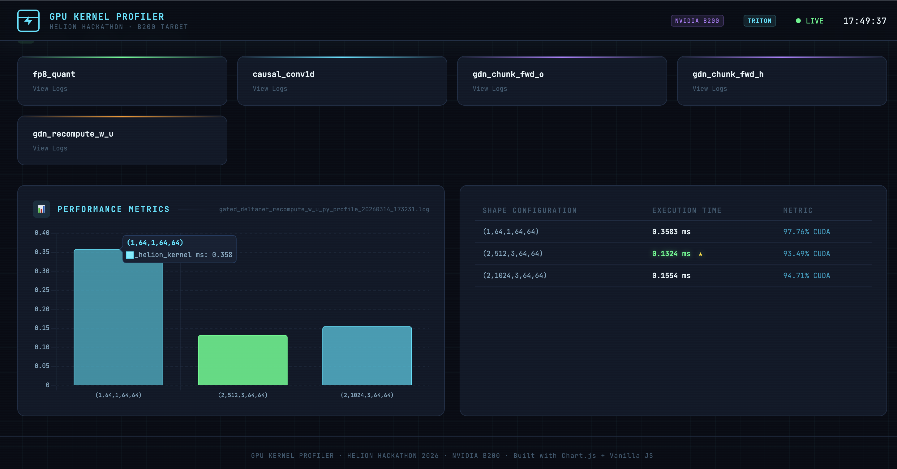

# Battlestars
Helion Hackathon Team Battlestars

## Current Status
We are competing in the PyTorch Helion Hackathon. The goal is to write high-performance GPU kernels using the Python-based Helion DSL to maximize Correctness and Performance points on the official leaderboard. We are currently SSH'd into an Ubuntu Nebius B200 GPU instance (`helion-dear-emu`).

### Current Problem
We are working on the `fp8_quant` warm-up problem (100 correctness points, 0 performance points) and preparing for fully-scored performance problems like `causal_conv1d`.

---

## Instructions & Submission Workflow

**CRITICAL:** The local machine is strictly for code development. All execution, testing, benchmarking, and official submissions **MUST** happen on the remote Nebius B200 GPU instance.

For detailed, step-by-step commands to run on your SSH session, see:
👉 **[SUBMIT.md](./SUBMIT.md)**

### Key Rules
- **ONLY** modify `submission.py` in each project folder.
- **NO AUTOTUNE** on KernelBot: Hardcode your `helion.Config` values before final submission.
- **SPAWN MODE:** Always use `export HELION_AUTOTUNE_PRECOMPILE=spawn` to prevent hangs.

### **Environment Variables & Rules (For Remote GPU)**
- `HELION_AUTOTUNE_PRECOMPILE=spawn` (Crucial for preventing compiler hangs)
- `ENABLE_TILE=1` and `HELION_BACKEND=tileir` (Test for extra 1.6x speedup)
- Use `#!POPCORN` headers at the top of `submission.py` for `leaderboard` and `gpu`.
- Only your best submission counts.
- Deadline is 6:00 PM today.

---

## GPU Kernel Profiler

The **GPU Kernel Profiler** is our custom web-based dashboard designed to rapidly evaluate and visualize Helion kernel performance during the hackathon.

### How it Works

* **Trigger Experiments:** Use the "Deploy to B200" panel in the UI to remotely dispatch jobs. You can select the kernel (e.g., `causal_conv1d`, `fp8_quant`) and the execution mode (`benchmark`, `profile`, or `test`). The web app executes scripts to deploy the job directly to our Nebius B200 instance.
* **Retrieve Results:** The dashboard continuously polls for new logs generated by the remote instance. Once a job is complete, the logs are synced back to the local `helion/logs` directory.
* **Visualize Performance:** The UI parses the raw `.log` files (including PyTorch Profiler tables) and generates interactive bar charts using Chart.js.
* **Identify Optimal Configs:** The table view lists all tested shape configurations, extracts their execution time, identifies the percentage of time spent on the GPU, and automatically highlights the absolute fastest configuration (★) so you can hardcode it into `submission.py`.
